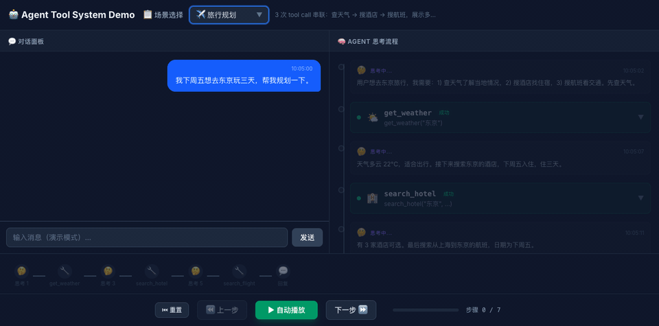

# Claude Code from Scratch

[](https://www.typescriptlang.org/)
[](https://react.dev/)
[](LICENSE)

A minimal coding agent CLI built from scratch (~3000 lines), inspired by Claude Code. Includes an interactive **Agent Tool System Demo** — a visual playground that demonstrates how an LLM agent thinks, calls tools, recovers from errors, and arrives at a response.

---

## 📦 Project Structure

```
claude-code-from-scratch/
├── src/                    ← CLI Agent Core (Node.js + TypeScript)
│   ├── agent.ts            Agent loop & orchestration
│   ├── tools.ts            Tool definitions & execution
│   ├── ui.ts               Terminal UI (chalk)
│   ├── prompt.ts           System prompt builder
│   ├── session.ts          Session persistence
│   └── ...
├── demo/                   ← Agent Tool System Demo (React + Vite)
│   └── src/
│       ├── engine/
│       │   ├── types.ts        Core types (ToolCall, AgentStep, etc.)
│       │   ├── scenarios.ts    3 preset scenarios with full step data
│       │   ├── tools.ts        Tool definitions & mock executor
│       │   └── agent.ts        AgentLoop simulator (play/pause/step)
│       └── components/
│           ├── ChatPanel.tsx        Left: conversation messages
│           ├── AgentFlow.tsx        Right: agent thinking timeline
│           ├── ToolCard.tsx         Expandable tool call card
│           ├── StepTimeline.tsx     Horizontal step timeline
│           └── ScenarioSelector.tsx Scenario dropdown
```

---

## 🚀 Quick Start

```bash
# CLI Agent
npm install && npm run dev

# Demo (playground)
cd demo && npm install && npm run dev
```

Open http://localhost:5173/ to see the Agent Tool System Demo.

**Live Demo:** [agent-playground-ruddy.vercel.app](https://agent-playground-ruddy.vercel.app)



---

## 🧠 Demo: Three Scenarios

| Scenario | Steps | What It Shows |
|----------|-------|---------------|
| 🌤️ Weather Q&A | 3 | Simplest tool call: thought → tool → response |
| ✈️ Travel Planning | 7 | Multi-tool orchestration: 3 chained tool calls |
| 🔄 Error Recovery | 5 | 1st call fails → agent analyzes → retry → success |

Each scenario demonstrates a different aspect of agent behavior. Use the playback controls (prev/play/next) to step through the agent's reasoning process.

---

## 🛠️ Technical Highlights

- **Pure frontend, no backend** — All data is pre-simulated in scenarios, zero API dependencies
- **AgentLoop simulator** — Time-sliced playback engine with play/pause/step/reset
- **Progressive chat** — Agent response appears as soon as the reasoning reaches the reply step
- **Error-first UX** — Failed tool calls auto-expand to show error details
- **Dark theme** — Matching Claude Code CLI visual style
- **Built with Claude Code** — Entire demo scaffolded by an AI coding agent
